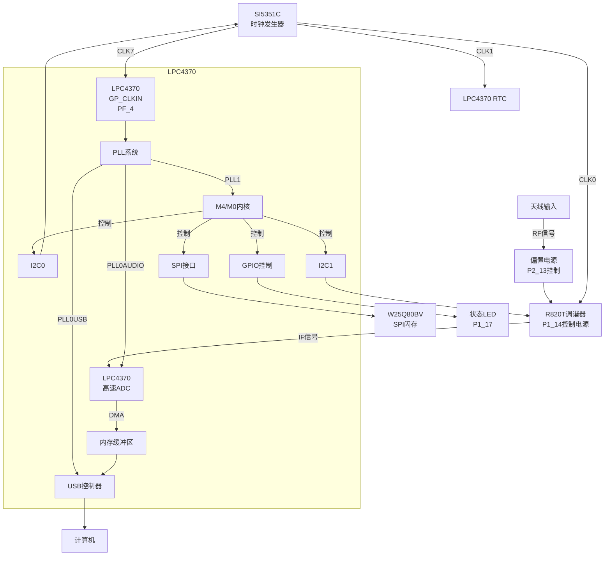
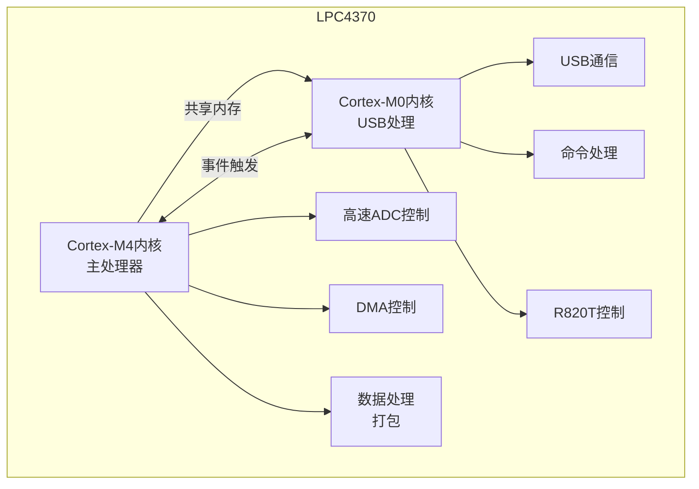
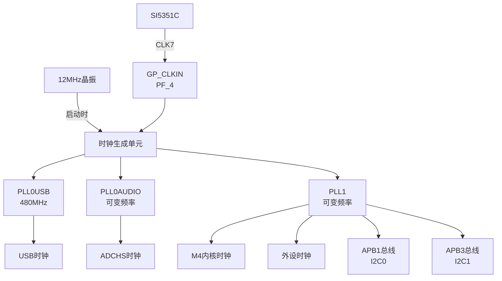
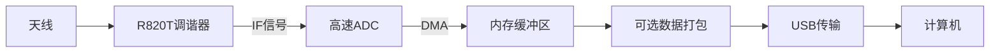
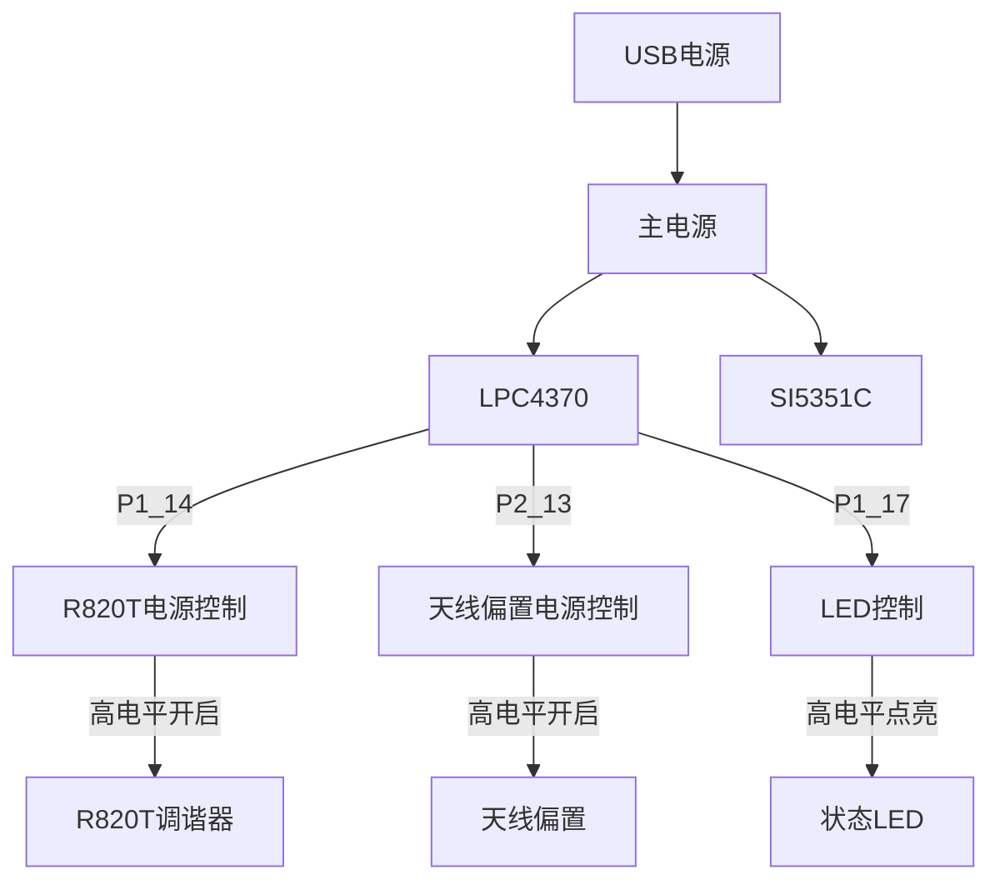

# Airspy 硬件系统框图

以下是 Airspy 软件定义无线电 (SDR) 设备的系统框图，展示了主要组件及其互连关系。

## 系统总体框图

## 多核处理架构

## 时钟系统

## 信号处理流程

## 电源控制系统

## 注意事项

1. 图中仅显示主要组件和连接，实际硬件可能包含更多细节
2. 部分引脚连接在代码中未明确指定，可能需要通过硬件检查确认
3. 时钟配置可根据不同的采样率和工作模式动态调整
4. 多核处理架构使用共享内存和事件触发机制进行通信
