# Airspy 固件代码执行流程分析

## 简介

Airspy 是一款高性能软件定义无线电 (SDR) 接收器，基于 NXP LPC4370 微控制器和 Rafael Micro R820T 调谐器。本文档详细分析了 Airspy 固件的代码执行流程，并通过流程图展示了各个功能模块和使用的硬件组件之间的交互关系。

## 硬件架构概述

Airspy 硬件由以下主要组件组成：

1. **LPC4370 微控制器** - 主处理器，包含 M4、M0 和 M0+ 内核
2. **R820T 调谐器** - 用于 RF 接收，频率范围 24MHz-1.8GHz
3. **SI5351C 时钟发生器** - 为系统提供时钟信号
4. **W25Q80BV SPI 闪存** - 1MB 容量，用于固件存储
5. **USB 接口** - 高速 USB 2.0，用于与计算机通信

## 多核处理架构

Airspy 利用 LPC4370 的多核架构进行任务分配：

- **M4 内核**：负责高速 ADC 采样、数据处理和打包
- **M0 内核**：负责 USB 通信、命令处理和 R820T 调谐器控制
- **M0+ 内核**：在某些配置中使用（可选）

核间通信通过共享内存和事件触发机制实现。

## 系统启动流程

### 1. 系统初始化

系统启动时，首先执行以下初始化步骤：

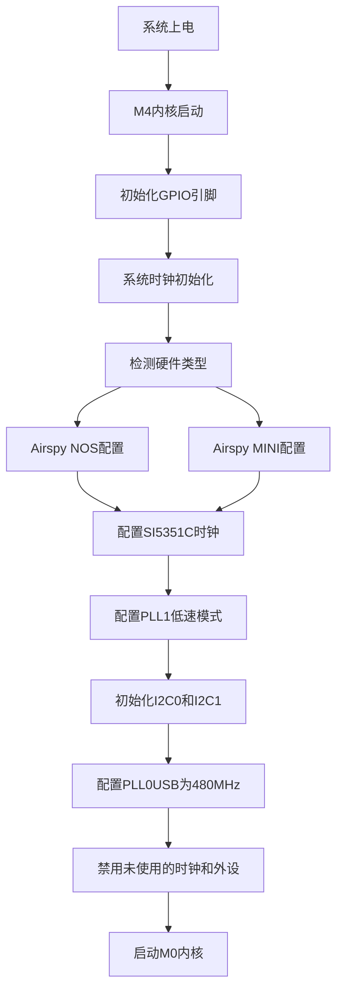

系统初始化过程在 `airspy_core.c` 中的 `sys_clock_init()` 函数中实现，主要完成以下任务：

1. 初始化 GPIO 引脚配置
2. 检测硬件类型（Airspy NOS 或 Airspy MINI）
3. 配置 SI5351C 时钟发生器
4. 配置 PLL1 为低速模式
5. 初始化 I2C0（用于 SI5351C）和 I2C1（用于 R820T）
6. 配置 PLL0USB 为 480MHz（用于 USB 接口）
7. 禁用未使用的时钟和外设以降低功耗
8. 启动 M0 内核

### 2. M4 内核主循环

M4 内核在 `airspy_m4.c` 中的 `main()` 函数中执行以下任务：

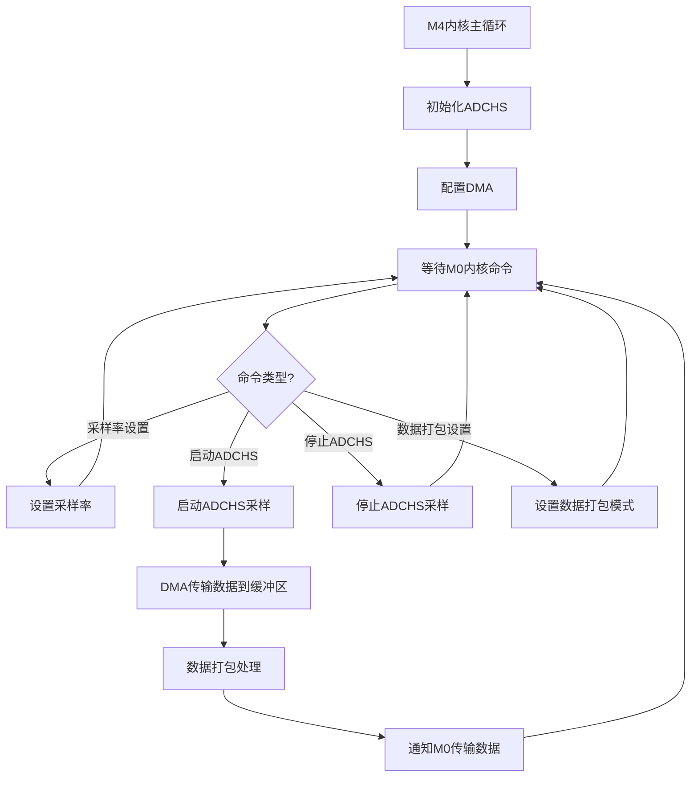

M4 内核主要负责：

1. 初始化高速 ADC (ADCHS)
2. 配置 DMA 传输
3. 等待来自 M0 内核的命令
4. 根据命令执行相应操作（设置采样率、启动/停止 ADCHS、设置数据打包模式）
5. 当 ADCHS 启动时，通过 DMA 将数据传输到共享缓冲区
6. 如果启用了数据打包，对数据进行打包处理
7. 通知 M0 内核传输数据到 USB

### 3. M0 内核主循环

M0 内核在 `airspy_m0.c` 中的 `main()` 函数中执行以下任务：

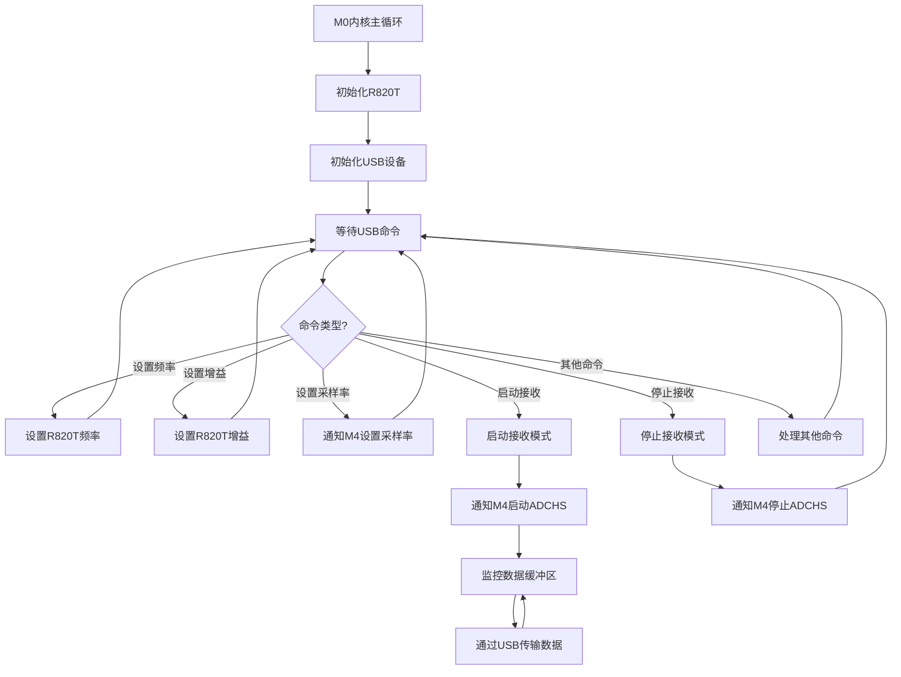

M0 内核主要负责：

1. 初始化 R820T 调谐器
2. 初始化 USB 设备
3. 等待来自 USB 主机的命令
4. 根据命令执行相应操作（设置频率、设置增益、设置采样率、启动/停止接收）
5. 当接收模式启动时，通知 M4 内核启动 ADCHS
6. 监控数据缓冲区，将数据通过 USB 传输到主机
7. 当接收模式停止时，通知 M4 内核停止 ADCHS

## 信号处理流程

Airspy 的信号处理流程如下：

1. 天线接收 RF 信号
2. R820T 调谐器将 RF 信号转换为 IF 信号（通常为 4.5MHz 或 5MHz）
3. LPC4370 的高速 ADC (ADCHS) 对 IF 信号进行采样
4. 通过 DMA 将采样数据传输到内存缓冲区
5. 可选的数据打包处理（提高 USB 传输效率）
6. 通过 USB 将数据传输到计算机

## 时钟系统

Airspy 使用复杂的时钟系统，主要包括：

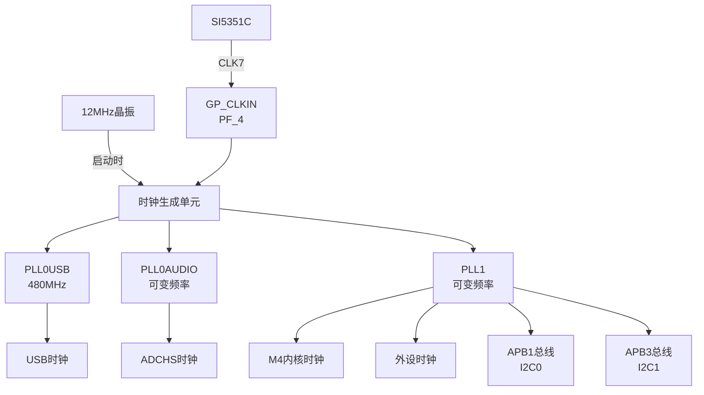

1. **PLL0USB**：配置为 480MHz，用于 USB 接口
2. **PLL0AUDIO**：用于 ADCHS 时钟，根据采样率动态配置
3. **PLL1**：用于 M4/M0 内核、外设、APB1 和 APB3 总线时钟
   - 低速模式：用于降低功耗
   - 高速模式：用于高性能处理

## 采样率配置流程

Airspy 支持多种采样率配置，配置流程如下：

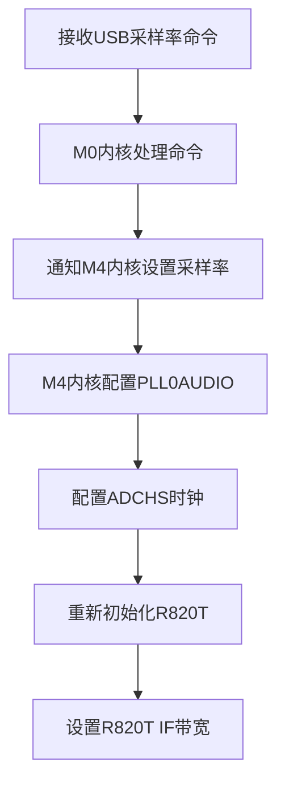

1. M0 内核接收来自 USB 主机的采样率设置命令
2. M0 内核通过共享内存通知 M4 内核设置采样率
3. M4 内核配置 PLL0AUDIO 以生成所需的 ADCHS 时钟频率
4. 重新初始化 R820T 调谐器，设置适当的 IF 频率和带宽

## 频率设置流程

Airspy 的频率设置流程如下：

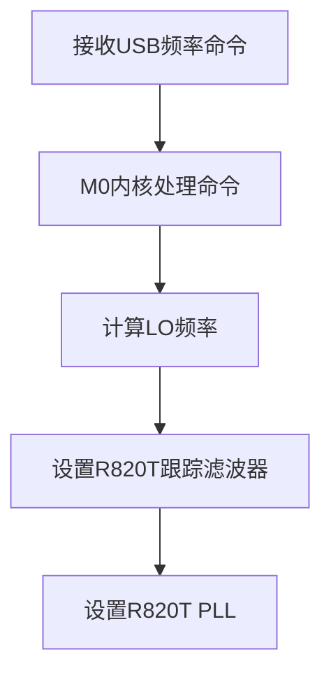

1. M0 内核接收来自 USB 主机的频率设置命令
2. 计算本地振荡器 (LO) 频率 = 目标频率 + IF 频率
3. 根据频率范围设置 R820T 的跟踪滤波器
4. 设置 R820T 的 PLL 以生成所需的 LO 频率

## 增益控制流程

Airspy 支持多级增益控制，包括：

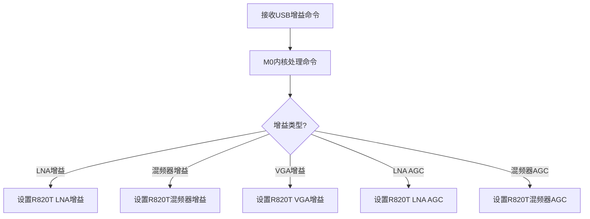

1. M0 内核接收来自 USB 主机的增益设置命令
2. 根据增益类型设置 R820T 的相应增益参数：
   - LNA 增益：低噪声放大器增益
   - 混频器增益：混频器增益
   - VGA 增益：可变增益放大器增益
   - LNA AGC：低噪声放大器自动增益控制
   - 混频器 AGC：混频器自动增益控制

## 数据传输流程

Airspy 的数据传输流程如下：

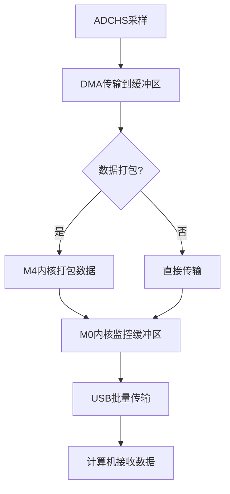

1. ADCHS 对 IF 信号进行采样
2. 通过 DMA 将采样数据传输到共享缓冲区
3. 如果启用了数据打包，M4 内核对数据进行打包处理
4. M0 内核监控缓冲区，当有新数据时通过 USB 批量传输到主机
5. 计算机接收并处理数据

## 电源控制系统

Airspy 的电源控制系统如下：

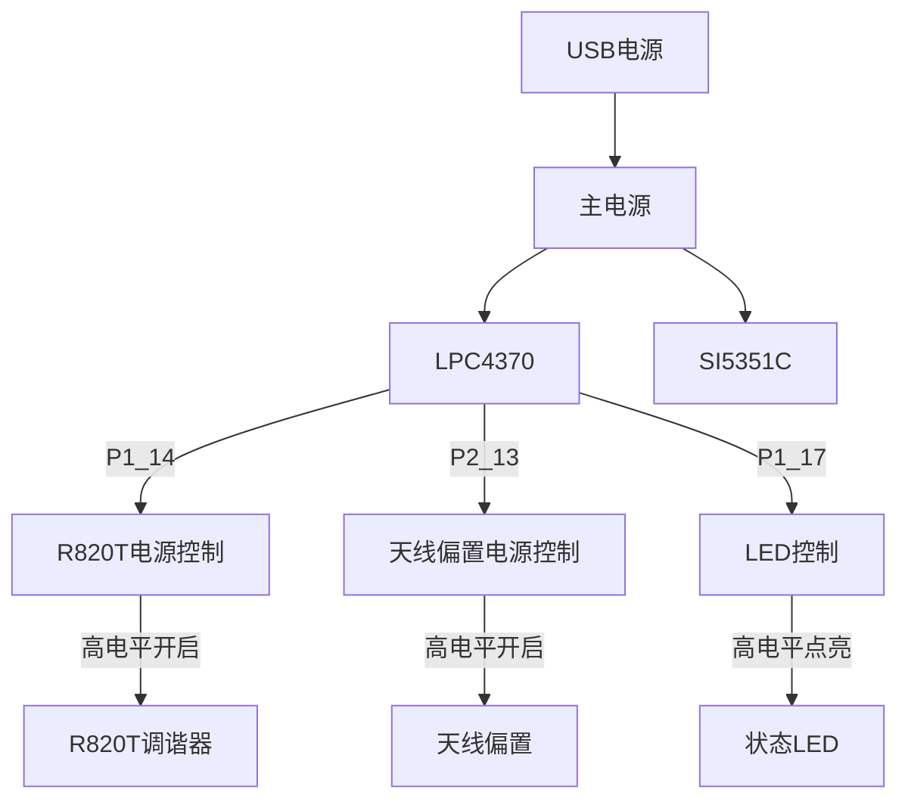

1. **R820T 电源**：由 P1_14 控制，高电平开启
2. **天线偏置电源**：由 P2_13 控制，高电平开启
3. **状态 LED**：由 P1_17 控制，高电平点亮

## 核间通信机制

Airspy 使用以下机制实现 M4 和 M0 内核之间的通信：

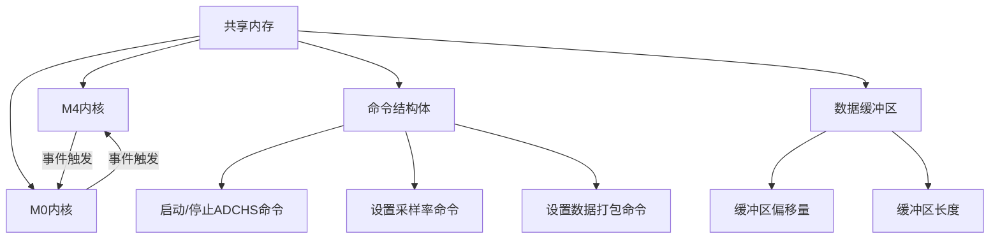

1. **共享内存**：M4 和 M0 内核通过共享内存区域交换数据和命令
2. **事件触发**：使用 SEV（发送事件）和 WFE（等待事件）指令进行核间同步
3. **命令结构体**：定义了各种命令的格式和参数
4. **数据缓冲区**：用于存储采样数据的共享缓冲区
5. **缓冲区管理**：通过缓冲区偏移量和长度实现数据的生产者-消费者模型

## 固件更新机制

Airspy 支持通过 USB 进行固件更新，使用以下机制：

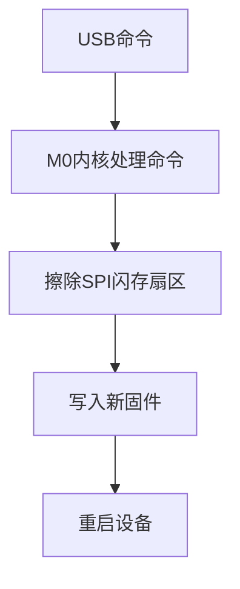

1. W25Q80BV SPI 闪存用于存储固件
2. 支持扇区擦除和页编程
3. 支持从 ROM 到 RAM 的代码执行

## 总结

Airspy 固件采用多核架构，通过 M4 和 M0 内核的协作实现高效的信号处理和数据传输。系统使用复杂的时钟配置和电源管理机制，支持多种采样率和频率范围。通过深入理解代码执行流程，可以更好地利用 Airspy 进行软件定义无线电应用开发。

## 参考资料

- Airspy 官方文档：https://airspy.com/
- GitHub 仓库：https://github.com/airspy/firmware
- LPC4370 数据手册：https://www.nxp.com/
- R820T 数据手册：http://superkuh.com/rtlsdr.html
