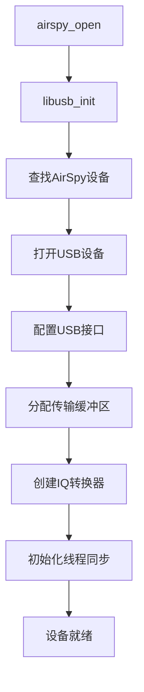
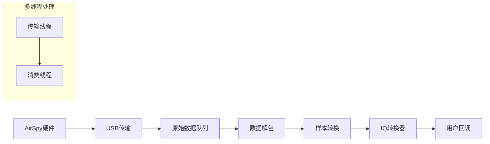
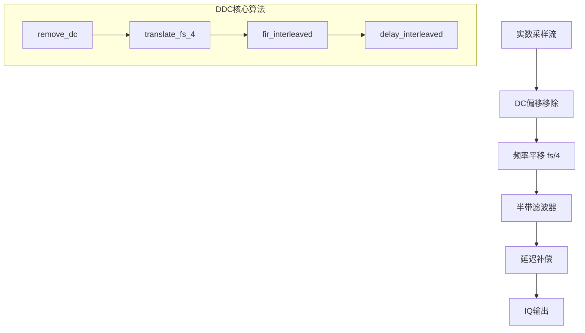
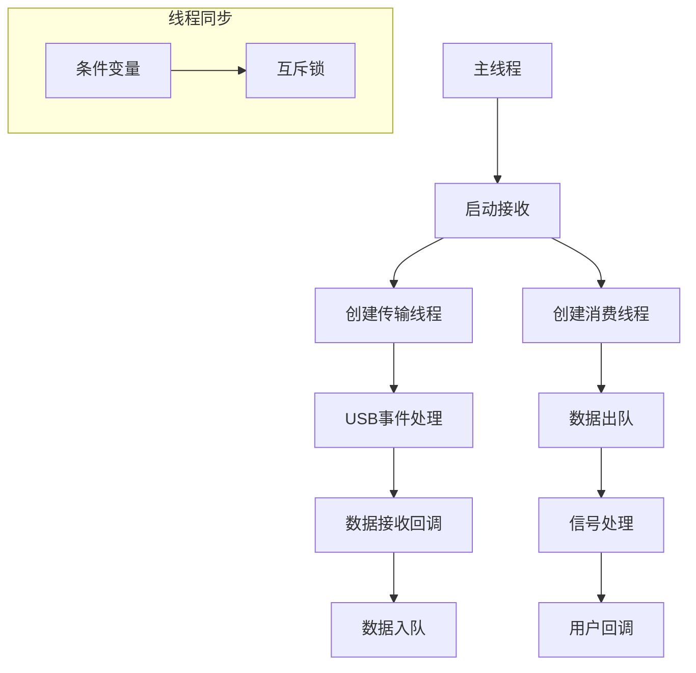

# AirSpy Host 代码分析文档

## 项目概述

AirSpy Host是一个用于控制AirSpy软件定义无线电(SDR)设备的主机端软件库和工具集。该项目包含核心库`libairspy`和配套工具`airspy-tools`，提供了完整的SDR设备控制、数据采集和信号处理功能。

## 项目结构

```
airspyone_host/
├── libairspy/          # 核心库
│   └── src/
│       ├── airspy.c           # 主要API实现
│       ├── airspy.h           # 公共API头文件
│       ├── iqconverter_float.c # 浮点数IQ转换器
│       ├── iqconverter_float.h
│       ├── iqconverter_int16.c # 16位整数IQ转换器
│       ├── iqconverter_int16.h
│       └── filters.h          # 滤波器系数定义
├── airspy-tools/       # 工具集
│   └── src/
│       ├── airspy_rx.c        # 数据接收工具
│       ├── airspy_info.c      # 设备信息工具
│       ├── airspy_calibrate.c # 校准工具
│       └── ...
└── cmake/              # 构建配置
```

## 核心功能模块

### 1. 设备管理模块 (airspy.c)

#### 设备初始化流程


#### 关键数据结构
```c
typedef struct airspy_device {
    libusb_context* usb_context;        // USB上下文
    libusb_device_handle* usb_device;   // USB设备句柄
    struct libusb_transfer** transfers; // USB传输数组
    airspy_sample_block_cb_fn callback; // 数据回调函数
    
    // 线程管理
    pthread_t transfer_thread;          // USB传输线程
    pthread_t consumer_thread;          // 数据消费线程
    
    // 缓冲区管理
    uint16_t *received_samples_queue[RAW_BUFFER_COUNT]; // 原始数据队列
    void *output_buffer;                // 输出缓冲区
    
    // 信号处理
    iqconverter_float_t *cnv_f;        // 浮点IQ转换器
    iqconverter_int16_t *cnv_i;        // 整数IQ转换器
    
    enum airspy_sample_type sample_type; // 采样类型
} airspy_device_t;
```

### 2. 数据流处理架构



#### 数据流详细处理步骤

1. **USB数据接收** (`airspy_libusb_transfer_callback`)
   - 接收来自AirSpy设备的原始12位ADC数据
   - 数据打包格式：每3个32位字包含8个12位样本

2. **数据解包** (`unpack_samples`)
   ```c
   // 将打包的12位数据解包为16位
   static inline void unpack_samples(uint32_t *input, uint16_t *output, int length)
   {
       for (i = 0, j = 0; j < length; i += 3, j += 8) {
           output[j + 0] = (input[i] >> 20) & 0xfff;
           output[j + 1] = (input[i] >> 8) & 0xfff;
           // ... 解包8个12位样本
       }
   }
   ```

3. **样本格式转换**
   - 12位ADC值转换为有符号格式：`(sample - 2048)`
   - 缩放到适当范围：浮点数使用`SAMPLE_SCALE`，整数使用位移

### 3. DDC (Digital Down Converter) 实现

DDC功能主要在`iqconverter_float.c`和`iqconverter_int16.c`中实现，用于将实数采样转换为复数IQ数据。

#### DDC处理流程



#### DDC关键函数分析

1. **主处理函数** (`iqconverter_float_process`)
   ```c
   void iqconverter_float_process(iqconverter_float_t *cnv, float *samples, int len)
   {
       remove_dc(cnv, samples, len);      // 移除DC偏移
       translate_fs_4(cnv, samples, len); // DDC处理
   }
   ```

2. **频率平移** (`translate_fs_4`)
   - 实现fs/4频率平移，将实数信号转换为复数IQ
   - 使用复数乘法：`[1, -j, -1, j]`的循环模式
   ```c
   // 频率平移序列：乘以 [-1, -hbc, 1, hbc]
   samples[j + 0] = -samples[j + 0];        // I通道反相
   samples[j + 1] = -samples[j + 1] * hbc;  // Q通道反相并乘以半带系数
   samples[j + 3] = samples[j + 3] * hbc;   // Q通道乘以半带系数
   ```

3. **半带滤波器** (`fir_interleaved`)
   - 使用47阶半带FIR滤波器进行抗混叠滤波
   - 滤波器系数定义在`filters.h`中
   - 优化实现：针对不同长度提供专门的函数

4. **延迟补偿** (`delay_interleaved`)
   - 补偿I/Q通道间的群延迟差异
   - 确保I/Q信号的相位对齐

### 4. DC Offset 移除实现

DC偏移移除是DDC处理的第一步，用于消除ADC和前端电路引入的直流分量。

#### DC移除算法

```c
#define SCALE (0.01f)  // 时间常数控制

static void remove_dc(iqconverter_float_t *cnv, float *samples, int len)
{
    float avg = cnv->avg;  // 当前DC估计值
    
    for (i = 0; i < len; i++) {
        samples[i] -= avg;           // 移除当前DC估计
        avg += SCALE * samples[i];   // 更新DC估计（一阶IIR滤波器）
    }
    
    cnv->avg = avg;  // 保存更新的DC估计
}
```

#### DC移除原理
- 使用一阶IIR高通滤波器：`H(z) = (1 - α) / (1 - α·z^-1)`
- 时间常数由`SCALE`参数控制，值越小响应越慢但稳定性越好
- 自适应跟踪DC偏移的缓慢变化

### 5. 滤波器设计

#### 半带滤波器系数 (filters.h)

```c
#define HB_KERNEL_FLOAT_LEN 47

const float HB_KERNEL_FLOAT[47] = {
    -0.000998606272947510,
     0.000000000000000000,  // 奇数索引为0（半带特性）
     0.001695637278417295,
     0.000000000000000000,
     // ... 
     0.500000000000000000,  // 中心抽头
     // ... 对称结构
};
```

#### 滤波器特性
- **类型**: 47阶线性相位FIR半带滤波器
- **通带**: 0 到 fs/4
- **阻带**: fs/4 到 fs/2
- **对称性**: 利用半带滤波器的对称性优化计算

### 6. 多线程架构



#### 线程同步机制
- **生产者-消费者模式**: 传输线程生产数据，消费线程处理数据
- **环形缓冲区**: 8个缓冲区的环形队列，避免内存分配开销
- **条件变量**: 用于线程间的高效同步

### 7. 采样类型支持

```c
enum airspy_sample_type {
    AIRSPY_SAMPLE_FLOAT32_IQ = 0,   // 32位浮点IQ
    AIRSPY_SAMPLE_FLOAT32_REAL = 1, // 32位浮点实数
    AIRSPY_SAMPLE_INT16_IQ = 2,     // 16位整数IQ
    AIRSPY_SAMPLE_INT16_REAL = 3,   // 16位整数实数
    AIRSPY_SAMPLE_UINT16_REAL = 4,  // 16位无符号整数实数
    AIRSPY_SAMPLE_RAW = 5,          // 原始12位数据
};
```

### 8. 增益控制系统

#### 增益级联结构
```
RF输入 → LNA → 混频器 → VGA → ADC
```

#### 预设增益模式
- **线性度模式**: 优化动态范围和线性度
- **灵敏度模式**: 优化接收灵敏度
- **手动模式**: 独立控制各级增益

### 9. 工具程序 (airspy_rx.c)

#### 主要功能
- 实时数据采集和文件保存
- 支持多种输出格式（WAV、原始数据）
- 命令行参数配置
- 性能监控和统计

#### 使用示例
```bash
# 接收900MHz信号，保存为WAV文件
airspy_rx -w -f 900 -a 10000000 -t 2

# 手动增益控制
airspy_rx -r output.bin -f 900 -v 10 -m 8 -l 6

# 线性度优化模式
airspy_rx -r output.bin -f 900 -g 15
```

## 性能优化特性

### 1. SIMD优化
- 在支持的平台上使用SSE2指令集
- 向量化FIR滤波器计算
- 提高实时处理性能

### 2. 内存对齐
- 使用16字节对齐的内存分配
- 优化缓存性能
- 减少内存访问延迟

### 3. 零拷贝设计
- USB传输缓冲区直接用于处理
- 最小化内存拷贝操作
- 降低CPU占用率

## 编译和部署

### 依赖项
- libusb-1.0: USB设备通信
- pthread: 多线程支持
- CMake: 构建系统

### 构建步骤
```bash
mkdir build
cd build
cmake ..
make
make install
```

## 总结

AirSpy Host项目实现了一个完整的SDR主机端解决方案，其核心特性包括：

1. **高效的DDC实现**: 通过fs/4频率平移和半带滤波实现实数到复数的转换
2. **自适应DC偏移移除**: 使用IIR滤波器实时跟踪和移除DC分量
3. **多线程架构**: 分离USB传输和信号处理，确保实时性能
4. **灵活的数据格式**: 支持多种采样类型和输出格式
5. **优化的信号处理**: 利用SIMD指令和内存对齐提高性能

该设计为SDR应用提供了稳定、高效的数据采集和初步信号处理能力，是软件定义无线电系统的重要组成部分。
