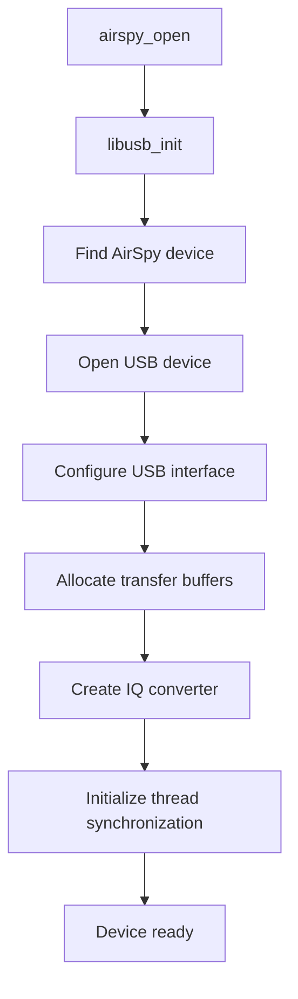
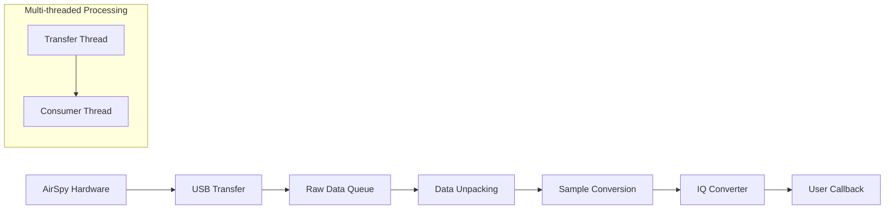
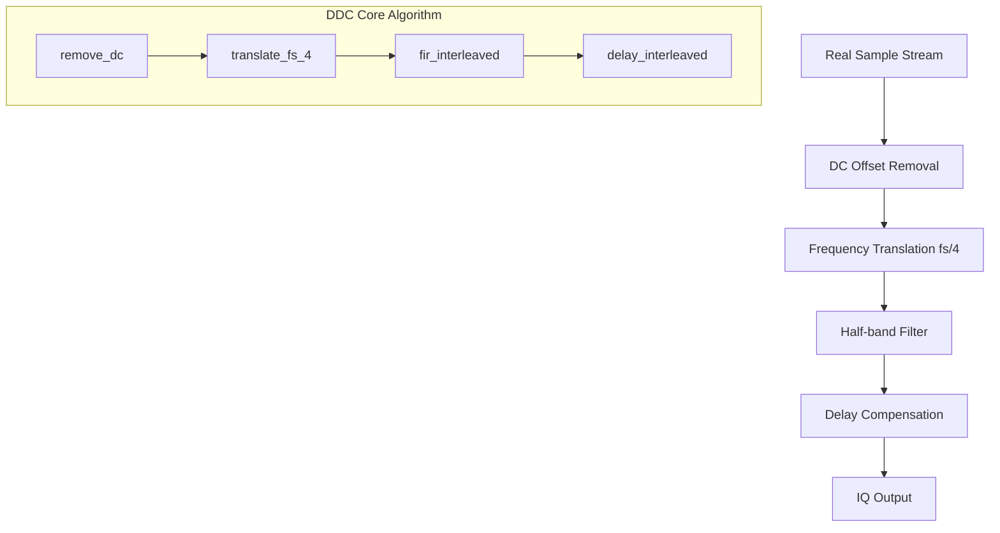
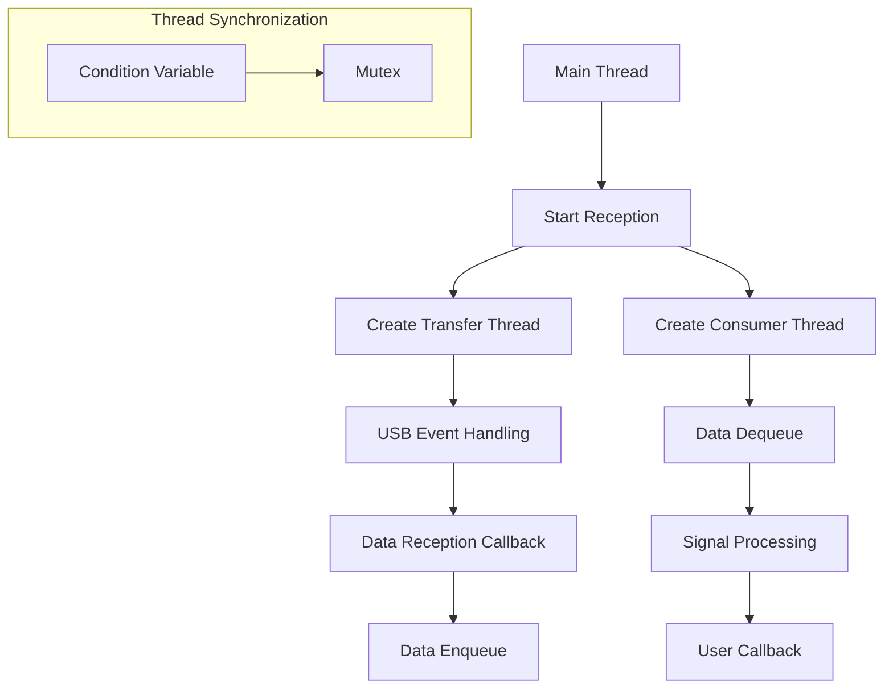

# AirSpy Host Code Analysis Documentation

## Project Overview

AirSpy Host is a host-side software library and toolset for controlling AirSpy Software Defined Radio (SDR) devices. The project includes the core library `libairspy` and accompanying tools `airspy-tools`, providing complete SDR device control, data acquisition, and signal processing capabilities.

## Project Structure

```
airspyone_host/
├── libairspy/          # Core library
│   └── src/
│       ├── airspy.c           # Main API implementation
│       ├── airspy.h           # Public API header file
│       ├── iqconverter_float.c # Floating-point IQ converter
│       ├── iqconverter_float.h
│       ├── iqconverter_int16.c # 16-bit integer IQ converter
│       ├── iqconverter_int16.h
│       └── filters.h          # Filter coefficient definitions
├── airspy-tools/       # Tool suite
│   └── src/
│       ├── airspy_rx.c        # Data reception tool
│       ├── airspy_info.c      # Device information tool
│       ├── airspy_calibrate.c # Calibration tool
│       └── ...
└── cmake/              # Build configuration
```

## Core Functional Modules

### 1. Device Management Module (airspy.c)

#### Device Initialization Flow


#### Key Data Structures
```c
typedef struct airspy_device {
    libusb_context* usb_context;        // USB context
    libusb_device_handle* usb_device;   // USB device handle
    struct libusb_transfer** transfers; // USB transfer array
    airspy_sample_block_cb_fn callback; // Data callback function
    
    // Thread management
    pthread_t transfer_thread;          // USB transfer thread
    pthread_t consumer_thread;          // Data consumer thread
    
    // Buffer management
    uint16_t *received_samples_queue[RAW_BUFFER_COUNT]; // Raw data queue
    void *output_buffer;                // Output buffer
    
    // Signal processing
    iqconverter_float_t *cnv_f;        // Floating-point IQ converter
    iqconverter_int16_t *cnv_i;        // Integer IQ converter
    
    enum airspy_sample_type sample_type; // Sample type
} airspy_device_t;
```

### 2. Data Flow Processing Architecture



#### Detailed Data Flow Processing Steps

1. **USB Data Reception** (`airspy_libusb_transfer_callback`)
   - Receives raw 12-bit ADC data from AirSpy device
   - Data packing format: Each 3 32-bit words contain 8 12-bit samples

2. **Data Unpacking** (`unpack_samples`)
   ```c
   // Unpack packed 12-bit data to 16-bit
   static inline void unpack_samples(uint32_t *input, uint16_t *output, int length)
   {
       for (i = 0, j = 0; j < length; i += 3, j += 8) {
           output[j + 0] = (input[i] >> 20) & 0xfff;
           output[j + 1] = (input[i] >> 8) & 0xfff;
           // ... unpack 8 12-bit samples
       }
   }
   ```

3. **Sample Format Conversion**
   - Convert 12-bit ADC values to signed format: `(sample - 2048)`
   - Scale to appropriate range: floating-point uses `SAMPLE_SCALE`, integer uses bit shifting

### 3. DDC (Digital Down Converter) Implementation

DDC functionality is primarily implemented in `iqconverter_float.c` and `iqconverter_int16.c`, used to convert real sampling to complex IQ data.

#### DDC Processing Flow



#### DDC Key Function Analysis

1. **Main Processing Function** (`iqconverter_float_process`)
   ```c
   void iqconverter_float_process(iqconverter_float_t *cnv, float *samples, int len)
   {
       remove_dc(cnv, samples, len);      // Remove DC offset
       translate_fs_4(cnv, samples, len); // DDC processing
   }
   ```

2. **Frequency Translation** (`translate_fs_4`)
   - Implements fs/4 frequency translation, converting real signals to complex IQ
   - Uses complex multiplication: cyclic pattern of `[1, -j, -1, j]`
   ```c
   // Frequency translation sequence: multiply by [-1, -hbc, 1, hbc]
   samples[j + 0] = -samples[j + 0];        // I channel inversion
   samples[j + 1] = -samples[j + 1] * hbc;  // Q channel inversion and multiply by half-band coefficient
   samples[j + 3] = samples[j + 3] * hbc;   // Q channel multiply by half-band coefficient
   ```

3. **Half-band Filter** (`fir_interleaved`)
   - Uses 47-tap half-band FIR filter for anti-aliasing filtering
   - Filter coefficients defined in `filters.h`
   - Optimized implementation: specialized functions for different lengths

4. **Delay Compensation** (`delay_interleaved`)
   - Compensates for group delay difference between I/Q channels
   - Ensures phase alignment of I/Q signals

### 4. DC Offset Removal Implementation

DC offset removal is the first step in DDC processing, used to eliminate DC components introduced by ADC and front-end circuits.

#### DC Removal Algorithm

```c
#define SCALE (0.01f)  // Time constant control

static void remove_dc(iqconverter_float_t *cnv, float *samples, int len)
{
    float avg = cnv->avg;  // Current DC estimate
    
    for (i = 0; i < len; i++) {
        samples[i] -= avg;           // Remove current DC estimate
        avg += SCALE * samples[i];   // Update DC estimate (first-order IIR filter)
    }
    
    cnv->avg = avg;  // Save updated DC estimate
}
```

#### DC Removal Principle
- Uses first-order IIR high-pass filter: `H(z) = (1 - α) / (1 - α·z^-1)`
- Time constant controlled by `SCALE` parameter, smaller values provide slower response but better stability
- Adaptively tracks slow changes in DC offset

### 5. Filter Design

#### Half-band Filter Coefficients (filters.h)

```c
#define HB_KERNEL_FLOAT_LEN 47

const float HB_KERNEL_FLOAT[47] = {
    -0.000998606272947510,
     0.000000000000000000,  // Odd indices are 0 (half-band property)
     0.001695637278417295,
     0.000000000000000000,
     // ... 
     0.500000000000000000,  // Center tap
     // ... Symmetric structure
};
```

#### Filter Characteristics
- **Type**: 47-tap linear phase FIR half-band filter
- **Passband**: 0 to fs/4
- **Stopband**: fs/4 to fs/2
- **Symmetry**: Utilizes half-band filter symmetry for computational optimization

### 6. Multi-threading Architecture



#### Thread Synchronization Mechanism
- **Producer-Consumer Pattern**: Transfer thread produces data, consumer thread processes data
- **Ring Buffer**: 8-buffer ring queue, avoiding memory allocation overhead
- **Condition Variables**: Used for efficient inter-thread synchronization

### 7. Sample Type Support

```c
enum airspy_sample_type {
    AIRSPY_SAMPLE_FLOAT32_IQ = 0,   // 32-bit floating-point IQ
    AIRSPY_SAMPLE_FLOAT32_REAL = 1, // 32-bit floating-point real
    AIRSPY_SAMPLE_INT16_IQ = 2,     // 16-bit integer IQ
    AIRSPY_SAMPLE_INT16_REAL = 3,   // 16-bit integer real
    AIRSPY_SAMPLE_UINT16_REAL = 4,  // 16-bit unsigned integer real
    AIRSPY_SAMPLE_RAW = 5,          // Raw 12-bit data
};
```

### 8. Gain Control System

#### Gain Cascade Structure
```
RF Input → LNA → Mixer → VGA → ADC
```

#### Preset Gain Modes
- **Linearity Mode**: Optimizes dynamic range and linearity
- **Sensitivity Mode**: Optimizes reception sensitivity
- **Manual Mode**: Independent control of each gain stage

### 9. Tool Programs (airspy_rx.c)

#### Main Functions
- Real-time data acquisition and file saving
- Support for multiple output formats (WAV, raw data)
- Command-line parameter configuration
- Performance monitoring and statistics

#### Usage Examples
```bash
# Receive 900MHz signal, save as WAV file
airspy_rx -w -f 900 -a 10000000 -t 2

# Manual gain control
airspy_rx -r output.bin -f 900 -v 10 -m 8 -l 6

# Linearity optimization mode
airspy_rx -r output.bin -f 900 -g 15
```

## Performance Optimization Features

### 1. SIMD Optimization
- Uses SSE2 instruction set on supported platforms
- Vectorized FIR filter computation
- Improves real-time processing performance

### 2. Memory Alignment
- Uses 16-byte aligned memory allocation
- Optimizes cache performance
- Reduces memory access latency

### 3. Zero-Copy Design
- USB transfer buffers used directly for processing
- Minimizes memory copy operations
- Reduces CPU utilization

## Compilation and Deployment

### Dependencies
- libusb-1.0: USB device communication
- pthread: Multi-threading support
- CMake: Build system

### Build Steps
```bash
mkdir build
cd build
cmake ..
make
make install
```

## Summary

The AirSpy Host project implements a complete SDR host-side solution with core features including:

1. **Efficient DDC Implementation**: Converts real to complex through fs/4 frequency translation and half-band filtering
2. **Adaptive DC Offset Removal**: Uses IIR filter to track and remove DC components in real-time
3. **Multi-threading Architecture**: Separates USB transfer and signal processing to ensure real-time performance
4. **Flexible Data Formats**: Supports multiple sample types and output formats
5. **Optimized Signal Processing**: Utilizes SIMD instructions and memory alignment to improve performance

