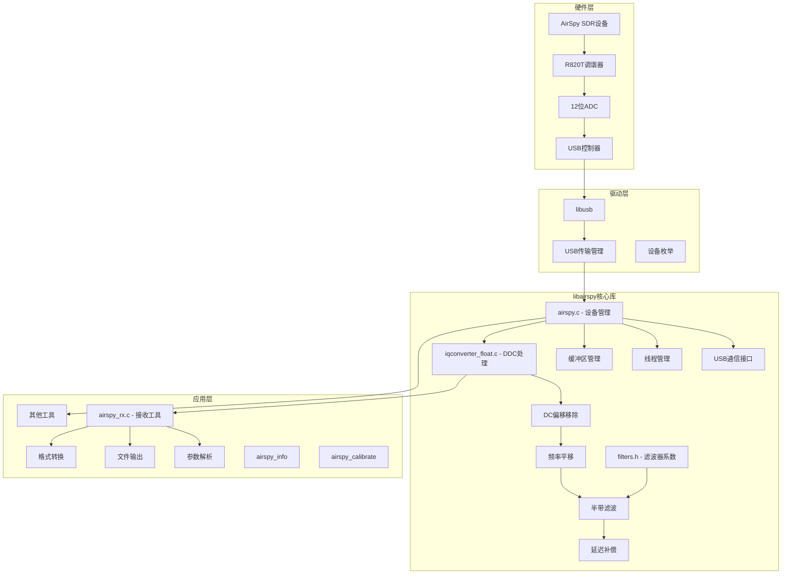
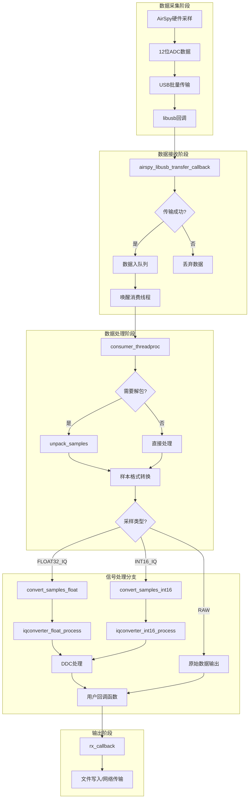
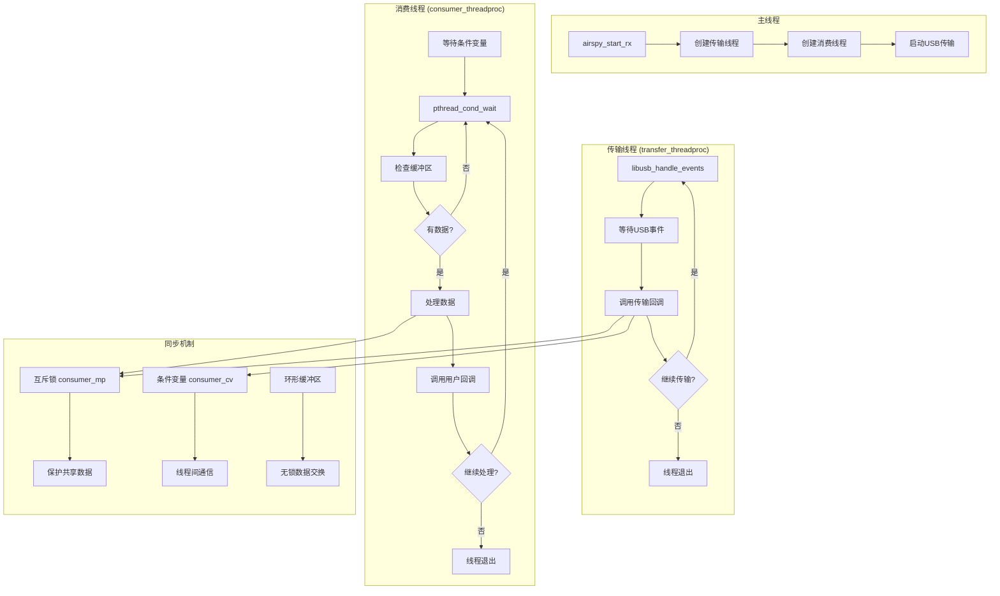
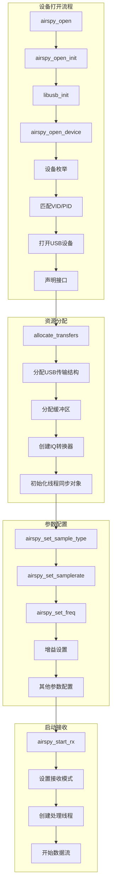
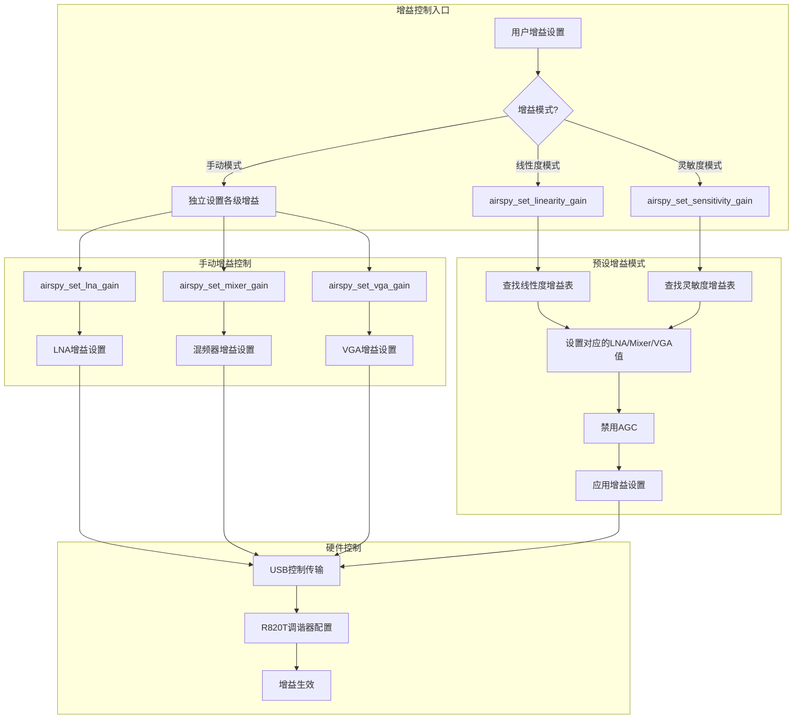
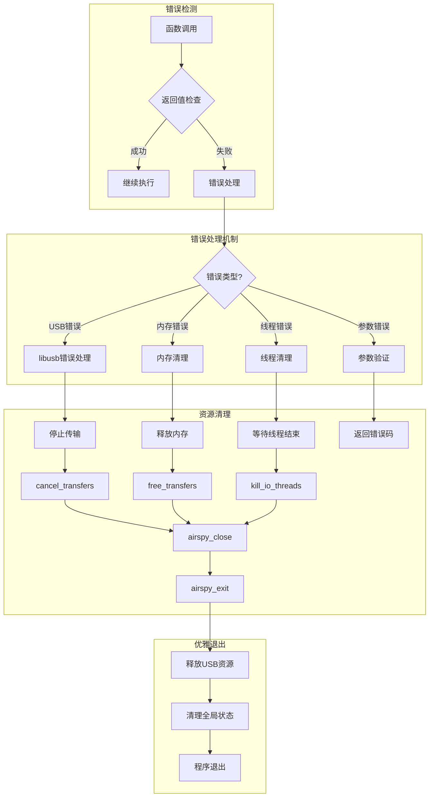

# AirSpy Host 系统流程图

## 1. 整体系统架构流程图



## 2. 数据流处理详细流程图



## 3. DDC (数字下变频) 详细处理流程

```mermaid
graph TD
    subgraph "DDC输入"
        A[实数采样序列] --> B[samples[0,1,2,3...]]
    end
    
    subgraph "DC偏移移除 (remove_dc)"
        B --> C[读取当前DC估计值]
        C --> D[samples[i] -= avg]
        D --> E[avg += SCALE * samples[i]]
        E --> F[更新DC估计值]
        F --> G{处理完所有样本?}
        G -->|否| D
        G -->|是| H[DC移除完成]
    end
    
    subgraph "频率平移 (translate_fs_4)"
        H --> I[fs/4频率平移]
        I --> J[samples[4k+0] *= -1]
        J --> K[samples[4k+1] *= -hbc]
        K --> L[samples[4k+2] *= 1]
        L --> M[samples[4k+3] *= hbc]
        M --> N[生成I/Q交替序列]
    end
    
    subgraph "半带滤波 (fir_interleaved)"
        N --> O[I通道滤波]
        O --> P[47阶FIR滤波器]
        P --> Q[利用半带特性优化]
        Q --> R[滤波后的I通道]
    end
    
    subgraph "延迟补偿 (delay_interleaved)"
        R --> S[Q通道延迟补偿]
        S --> T[延迟线处理]
        T --> U[相位对齐]
        U --> V[最终IQ输出]
    end
```

## 4. 多线程同步机制流程图



## 5. 设备初始化和配置流程图



## 6. 增益控制系统流程图



## 7. 错误处理和资源管理流程图



## 8. 性能优化策略流程图

```mermaid
graph TD
    subgraph "内存优化"
        A[内存对齐分配] --> B[16字节对齐]
        B --> C[缓存友好访问]
        C --> D[减少缓存未命中]
    end
    
    subgraph "计算优化"
        E[SIMD指令集] --> F[SSE2向量化]
        F --> G[并行FIR计算]
        G --> H[提高吞吐量]
    end
    
    subgraph "I/O优化"
        I[零拷贝设计] --> J[直接缓冲区操作]
        J --> K[减少内存拷贝]
        K --> L[降低CPU占用]
    end
    
    subgraph "线程优化"
        M[生产者-消费者模式] --> N[异步处理]
        N --> O[流水线并行]
        O --> P[提高实时性]
    end
    
    subgraph "算法优化"
        Q[半带滤波器特性] --> R[利用系数对称性]
        R --> S[减少乘法运算]
        S --> T[优化计算复杂度]
    end
```



这些流程图详细展示了AirSpy Host项目中各个代码模块之间的连接关系和数据流向，帮助理解整个系统的工作原理和DDC、DC offset的具体实现方式。
