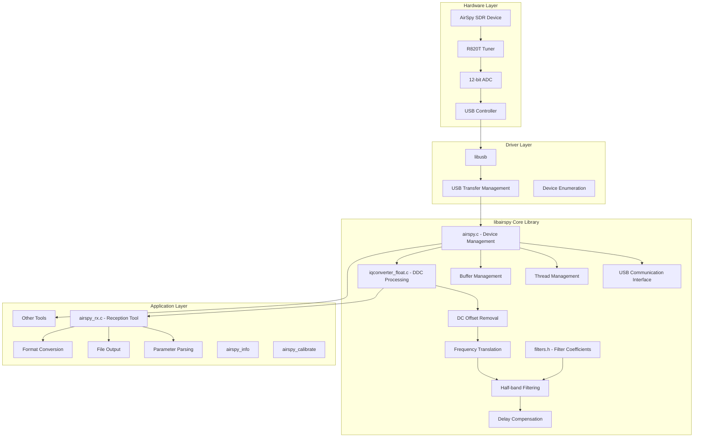
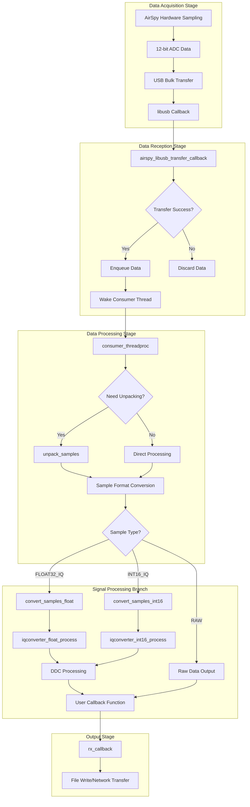
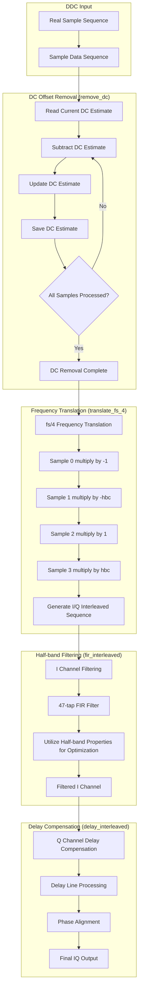
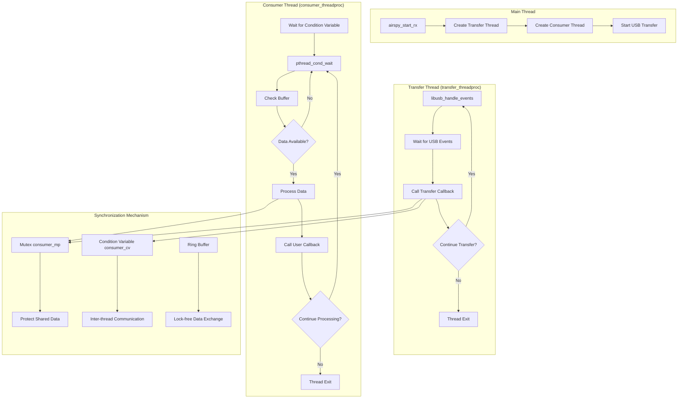
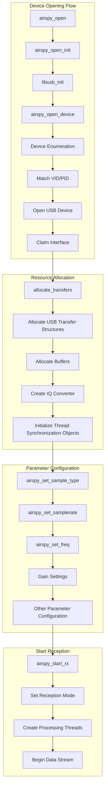
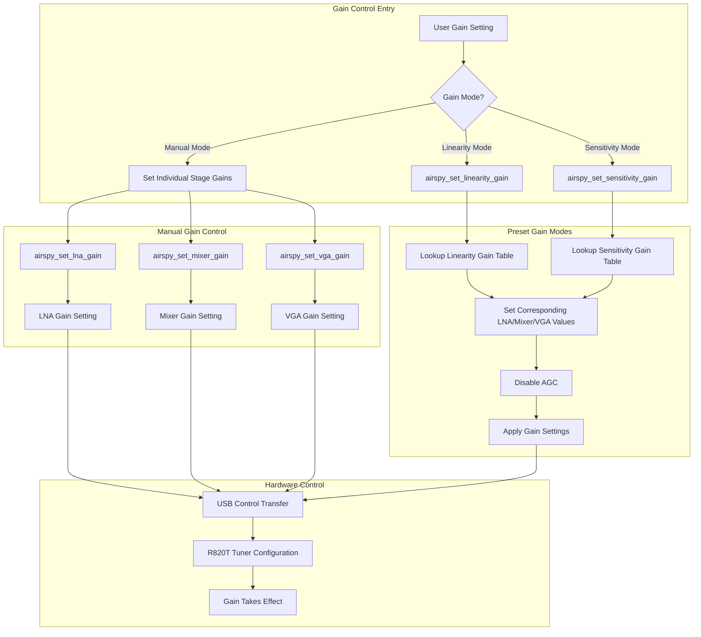
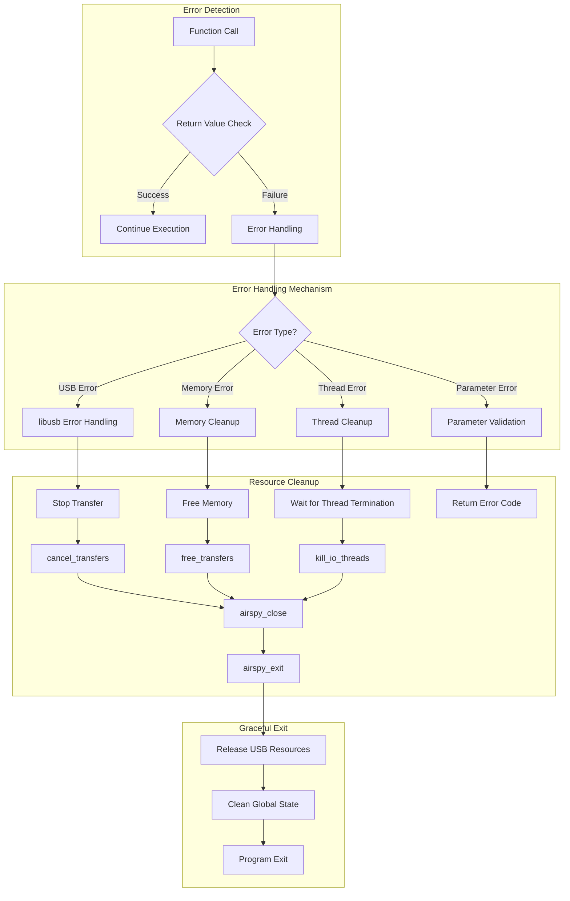

# AirSpy Host System Flowchart

## 1. Overall System Architecture Flowchart

## 2. Detailed Data Flow Processing Flowchart

## 3. DDC (Digital Down Converter) Detailed Processing Flow

## 4. Multi-threading Synchronization Mechanism Flowchart

## 5. Device Initialization and Configuration Flowchart

## 6. Gain Control System Flowchart

## 7. Error Handling and Resource Management Flowchart

## 8. Performance Optimization Strategy Flowchart

```mermaid
graph TD
    subgraph "Memory Optimization"
        A[Aligned Memory Allocation] --> B[16-byte Alignment]
        B --> C[Cache-friendly Access]
        C --> D[Reduce Cache Misses]
    end
    
    subgraph "Computational Optimization"
        E[SIMD Instruction Set] --> F[SSE2 Vectorization]
        F --> G[Parallel FIR Computation]
        G --> H[Improve Throughput]
    end
    
    subgraph "I/O Optimization"
        I[Zero-copy Design] --> J[Direct Buffer Operations]
        J --> K[Reduce Memory Copies]
        K --> L[Lower CPU Usage]
    end
    
    subgraph "Thread Optimization"
        M[Producer-Consumer Pattern] --> N[Asynchronous Processing]
        N --> O[Pipeline Parallelism]
        O --> P[Improve Real-time Performance]
    end
    
    subgraph "Algorithm Optimization"
        Q[Half-band Filter Properties] --> R[Utilize Coefficient Symmetry]
        R --> S[Reduce Multiplication Operations]
        S --> T[Optimize Computational Complexity]
    end
```

These flowcharts provide detailed visualization of the connections between various code modules in the AirSpy Host project and the data flow directions, helping to understand the overall system operation principles and the specific implementation of DDC and DC offset processing.
